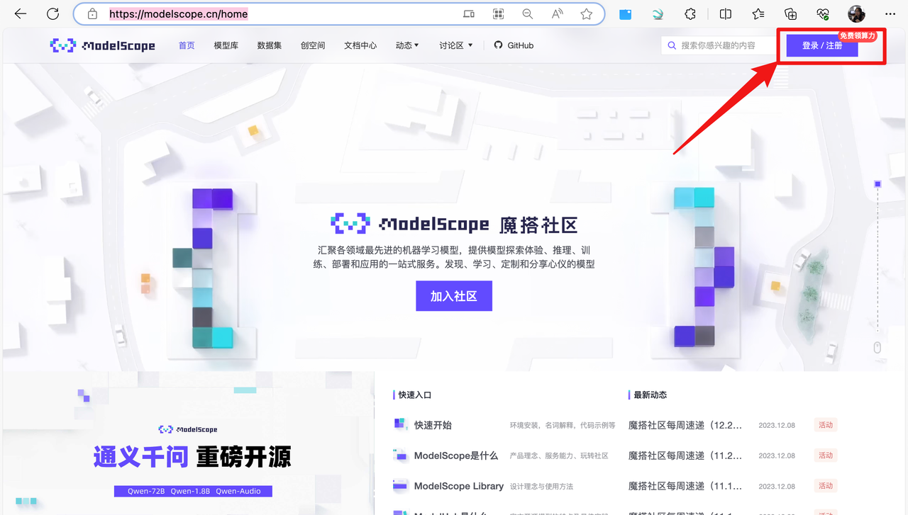
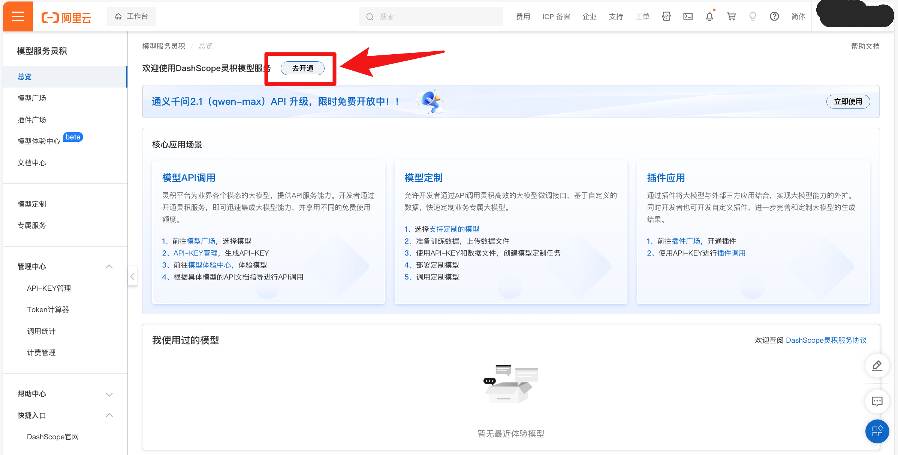
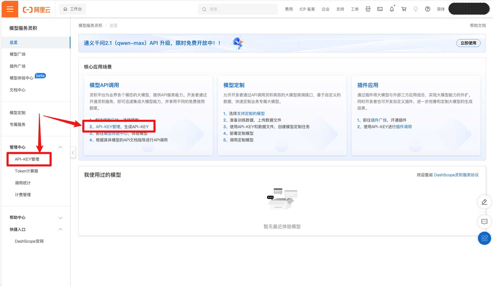
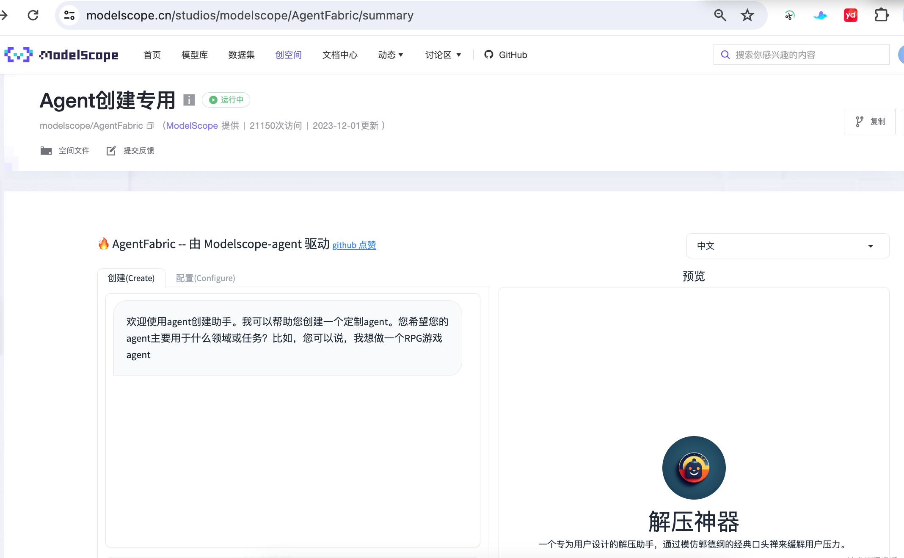
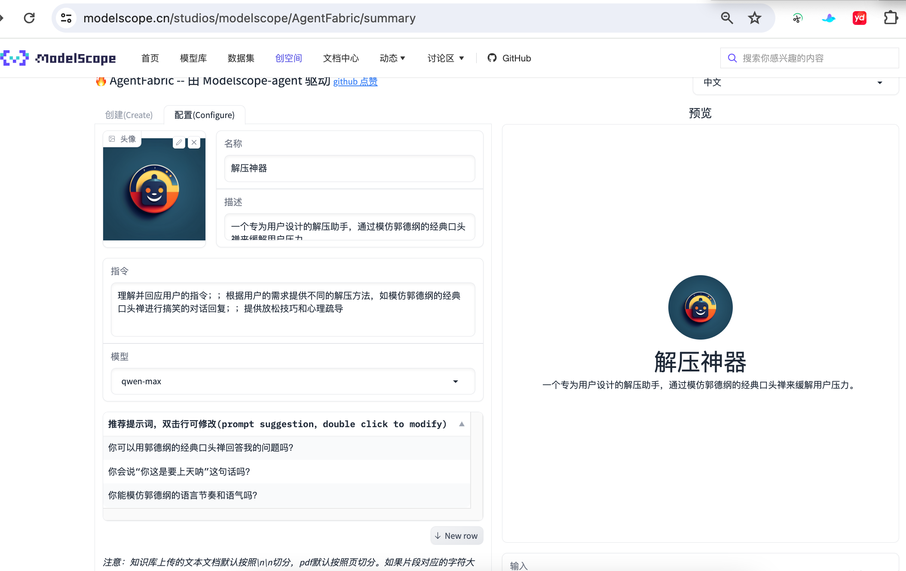
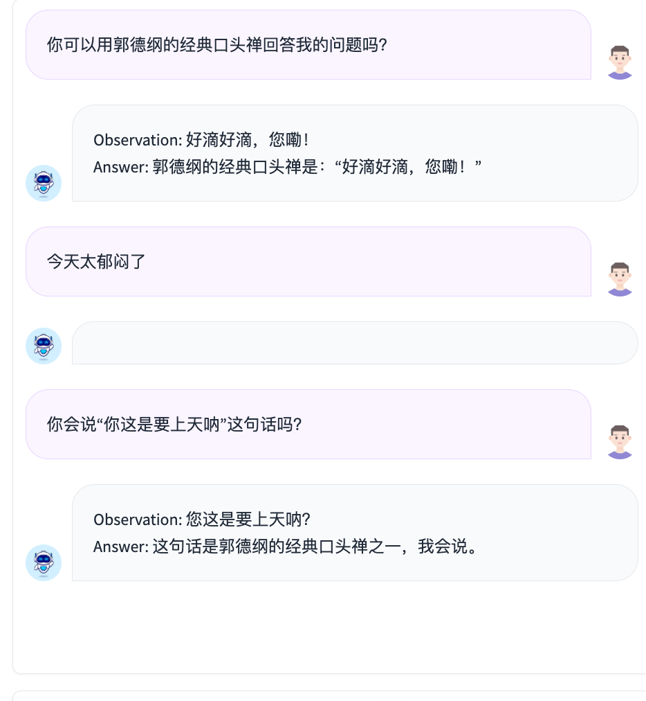
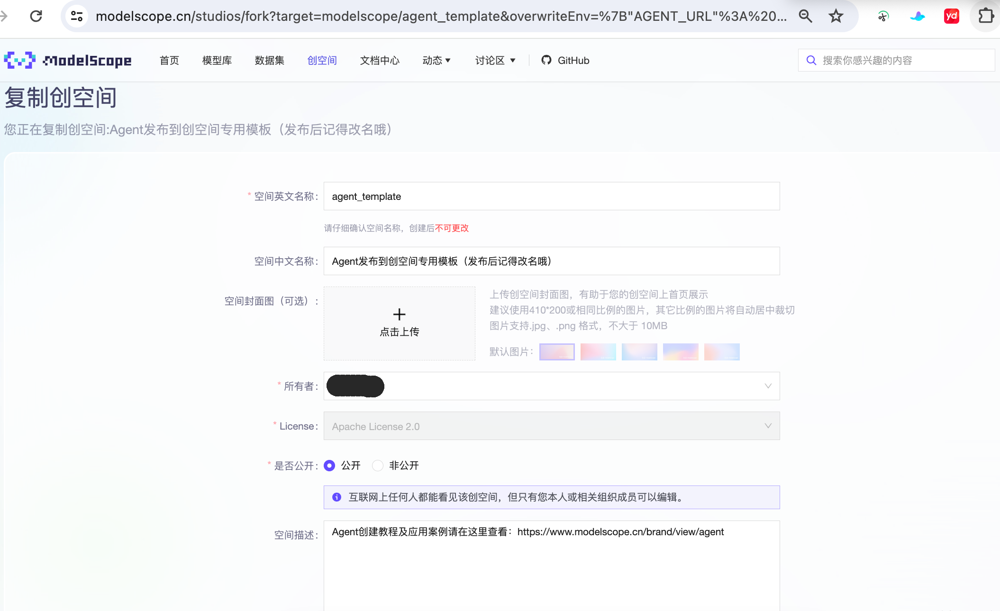
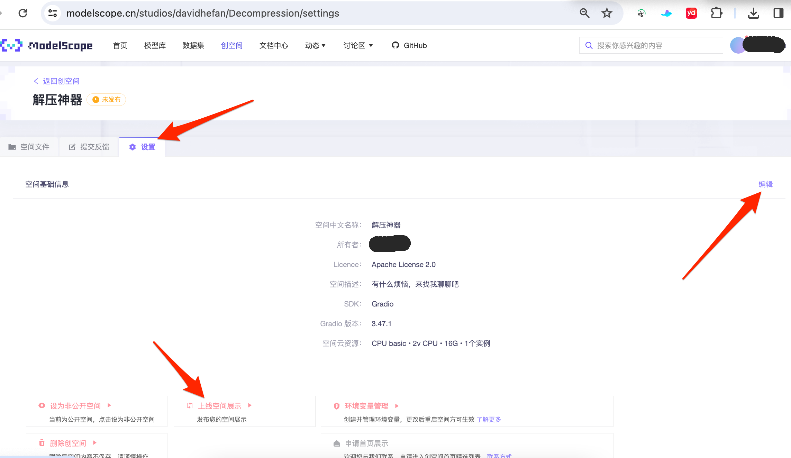
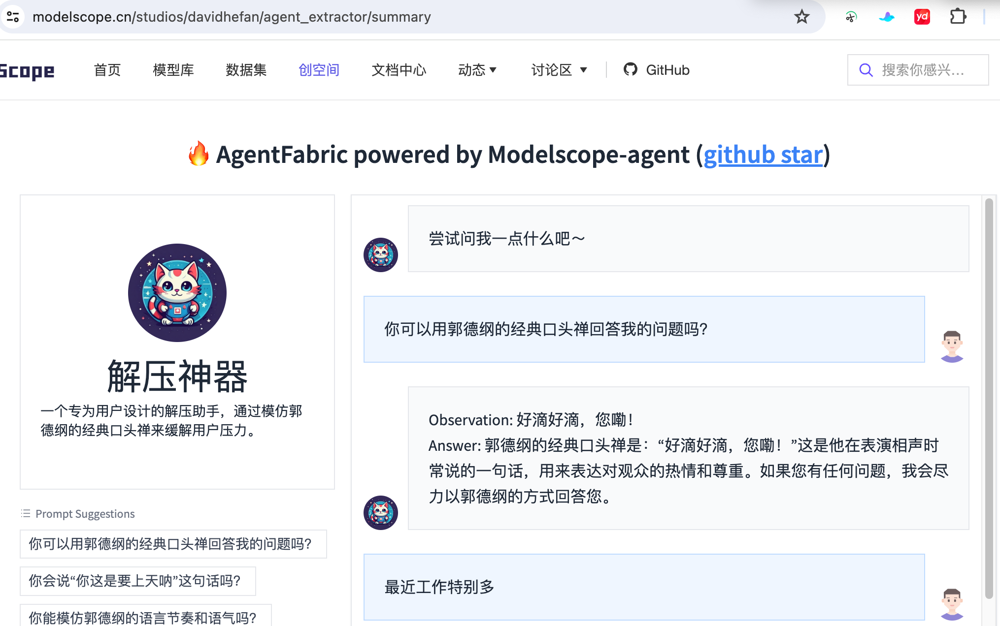

# ModelScope搭建Agent

自从OpenAI发布了GPT4，打造Agent生态以来，各种智能体涌现出来，但是在国内还是很多人无法体验这一能力。
现在魔搭社区基于通义大模型，给大家提供了另一种搭建Agent的渠道。

## 1.打开 魔搭社区，登录/注册账号

魔搭社区官网：[https://www.modelscope.cn/home](https://www.modelscope.cn/home)

## 2.创建通义千问API
### 2.1 开通 DashScope灵积模型服务

[阿里云平台](https://account.aliyun.com/login/login.htm?oauth_callback=https%3A%2F%2Fdashscope.console.aliyun.com%2Foverview%3Fspm%3D5176.28630291.0.0.24bf7eb5DMzdHh%26accounttraceid%3D7db56dd302c0465f85c674dc1371260dnunc&lang=zh)

登录阿里云账号，打开 DashScope管理控制台，开通 DashScope灵积模型服务

### 2.2 创建 API-KEY
回到控制台，创建 API-KEY，并记得复制保存！！！！

## 3.使用 魔搭Agent创建器 快速创建Agent
打开魔搭社区的 AgentFabric

左侧的【create】，是一个聊天界面，通过语言描述就能零代码创建一个Agent，右侧是即时体验界面

### 3.1 在左侧聊天框中发送你想要的功能
这里我给出一个 设计解压神器Agent 的example

一个专为用户设计的解压助手，通过模仿郭德纲的经典口头禅来缓解用户压力。

可以看到，它在回复的同时，多了2行字，分别是

✅Config Updated!
✅Logo Updated!

这是在调整Agent的配置，以及logo，可以在右边查看到具体的修改。
此外它还会反问一些问题，比如相声和口头语等。
可以通过回复来进行进一步的配置自动调整，但也可以不予理会，右边可以实时体验调整后的效果。

### 3.2 检查配置&提供Tool
点进左上角的【Configure】可以查看 Agent 的配置，其中的字段均可任意修改做Prompt Enginerring
下方的【Capabilities】是这个Agent可调用的Tool，目前可用的内置Tools有限，可按需勾选

### 3.3 体验Agent，做Prompt Engineering
右边的聊天框里随时可以体验 Agent，可自由根据实施效果进行Prompt修改，但修改后记得点击【Update Configuration】更新配置，否则效果不会有变化
还可以 点开▶，查看调用详情

### 3.4 发布 属于自己的Agent
创建Agent并实验效果满意后，点击【构建】，构建完成后点击【发布】

修改创空间信息，填入通义千问的 API-KEY，然后【复制创空间】
打开相应的创空间，进入【设置】、【上线空间展示】

等待发布成功，可以把链接发给其他人，就能让大家享受你创建的Agent了。

